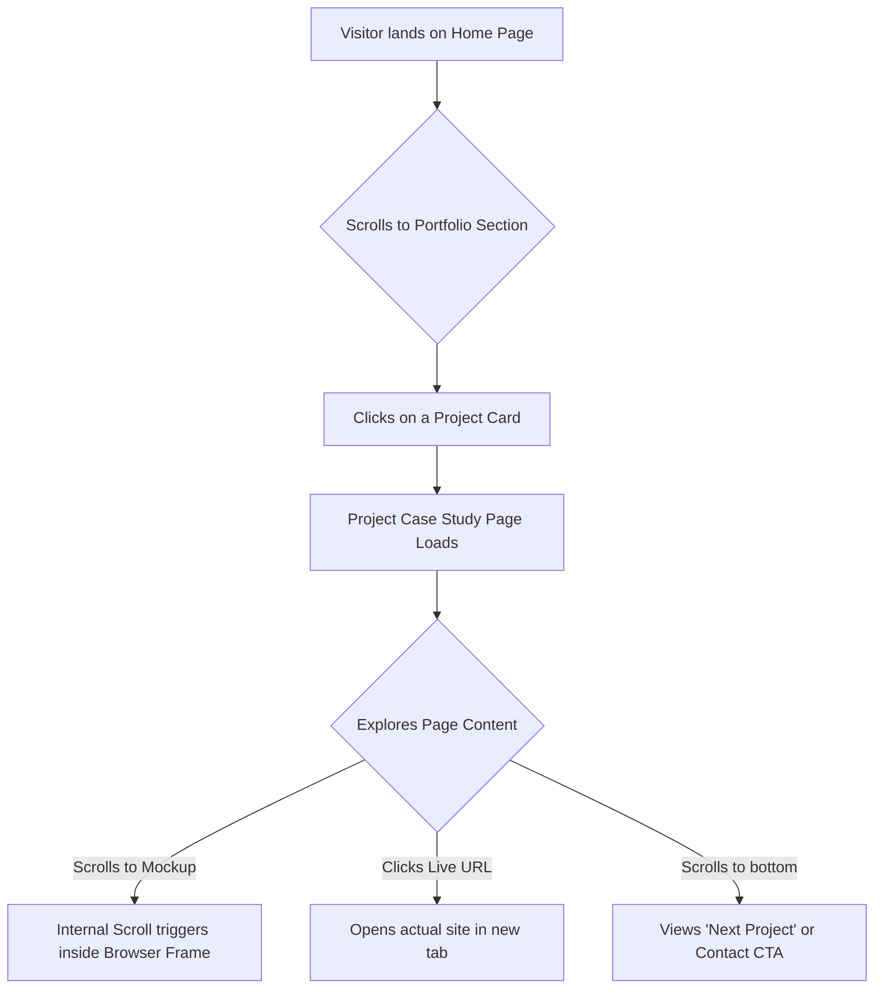
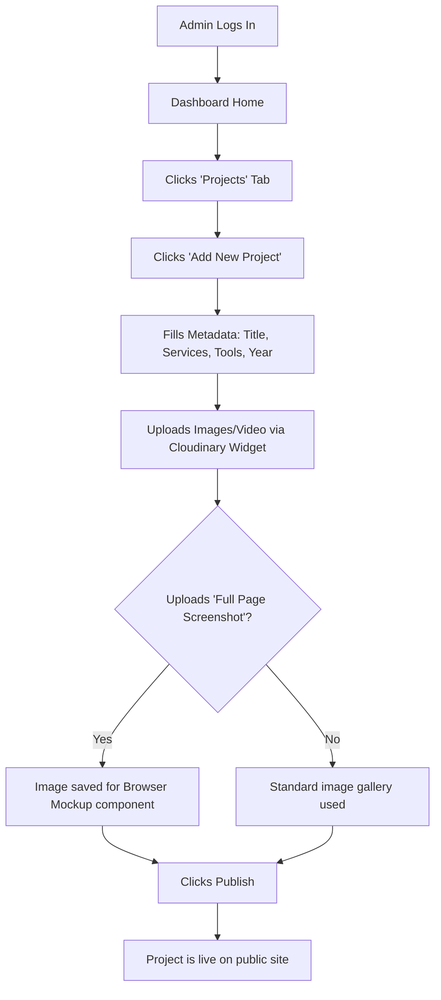
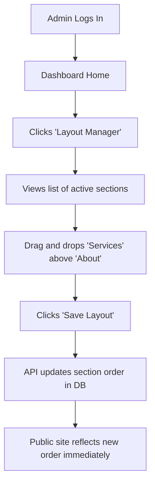

# UX Design: Luxury Designer Portfolio

## User Flows

### Flow 1: Visitor Exploring a Project Case Study

*Description:* The primary flow for a potential client discovering the designer's work. The transition from the Project Card to the Case Study page should be a seamless GSAP transition (e.g., image expands to fill the screen).

### Flow 2: Admin Creating a New Project (Menna's Feature)

*Description:* The Admin flow for adding a new project. This entire flow, including the DB schema, API, and Dashboard UI, will be built by **Menna**.

### Flow 3: Admin Reordering Sections (Naira's Feature)

*Description:* The Admin flow for dynamic layout management. This entire flow will be built by **Naira**.

## Wireframes

### Screen 1: Public - Project Case Study Page
```text
+---------------------------------------------------+
| [Logo]                    [Work] [About] [Contact]|
+---------------------------------------------------+
|                                                   |
|  [ HUGE PROJECT TITLE - INTERACTIVE TYPOGRAPHY ]  |
|                                                   |
+---------------------------------------------------+
| Overview:                 | Services:  Branding   |
| [Description Text]        | Tools:     Figma      |
|                           | Year:      2026       |
+---------------------------------------------------+
|                                                   |
|             [ FULL WIDTH VIDEO / HERO ]           |
|                                                   |
+---------------------------------------------------+
|    +-----------------------------------------+    |
|    | (O) (O) (O)  Browser Mockup Frame       |    |
|    +-----------------------------------------+    |
|    |                                         |    |
|    |      [LONG SCROLLABLE SCREENSHOT]       |    |
|    |                                         |    |
|    +-----------------------------------------+    |
|               [ LIVE URL BUTTON ]                 |
+---------------------------------------------------+
| Next Project: [Card]             [Contact CTA]    |
+---------------------------------------------------+
| Footer                                            |
+---------------------------------------------------+
```
*Component Description:* The Browser Mockup is a custom component that locks the main page scroll momentarily (or uses a specific GSAP ScrollTrigger) to allow the user to scroll through the embedded long screenshot, mimicking a real browsing experience.

### Screen 2: Dashboard - Add Project (Menna)
```text
+---------------------------------------------------+
| Sidebar       |  Add New Project                  |
| - Overview    |                                   |
| - Projects    |  Title: [_________________]       |
| - Services    |  Slug:  [_________________]       |
| - Blog        |                                   |
| - Layout      |  Services (Select): [Branding v]  |
| - SEO         |  Platform: [Shopify v]            |
|               |                                   |
|               |  Upload Hero Media: [ Browse ]    |
|               |  Upload Full-Page Mockup: [ Browse]
|               |                                   |
|               |  [ Cancel ]        [ Publish ]    |
+---------------------------------------------------+
```

## Screen List
| ID | Name | Purpose | User | Priority | Links |
|----|------|---------|------|----------|-------|
| PUB-01 | Home | Landing page with 3D Hero | Visitor | Must | PUB-02, PUB-04 |
| PUB-02 | Project Index | Filterable list of work | Visitor | Must | PUB-03 |
| PUB-03 | Project Details | Deep dive into a case study | Visitor | Must | PUB-04 |
| PUB-04 | Contact | Lead generation form | Visitor | Must | - |
| DASH-01| Dashboard Login | Auth | Admin | Must | DASH-02 |
| DASH-02| Projects Manager | CRUD for projects (Menna) | Admin | Must | - |
| DASH-03| Layout Manager | Drag & drop sections (Naira)| Admin | Must | - |
| DASH-04| Blog Manager | CRUD for blog posts (Naira) | Admin | Should | - |

## Interaction Patterns
- **Page Transitions:** Next.js route transitions intercepted by GSAP for smooth page wipes (no hard reloads).
- **Custom Cursor:** A custom cursor that expands when hovering over clickable elements like the "Live URL" or Project Cards.
- **Scroll Hijacking (Controlled):** Only used intentionally inside the Browser Mockup component via ScrollTrigger, never globally.
- **Dashboard Feedback:** Toast notifications (e.g., using `sonner` or `react-hot-toast`) for successful saves/uploads in the admin panel.

## Accessibility
- **Animations:** Respect `prefers-reduced-motion` media query by disabling GSAP/3D animations for users with motion sensitivity.
- **Keyboard Nav:** Ensure the custom Browser Mockup can be scrolled using keyboard arrow keys.
- **Contrast:** The Dark Luxury theme (Burgundy/Black) must be tested to ensure text meets WCAG AA contrast standards.

## Design Notes
- **Vertical Slice Enforcement:** Notice how the UX flows are explicitly split. Menna is responsible for designing, building, and wiring the entire 'Projects' ecosystem (DASH-02 -> API -> DB -> PUB-03). Naira is responsible for the 'Layout & Content' ecosystem (DASH-03 -> API -> DB -> PUB-01 Layout logic).

## Visual & Design References
- **Approved Base Design (Colors/Gradients):** [Atelier Arcana Art](https://atelier-arcana-art.lovable.app) - This establishes the core color palette and mood.
- **3D & Animation Benchmark:** [Stelllar Vision](https://stelllar.vision) - The gold standard for the professional 3D integration we are aiming for (using Three.js / GSAP).
- **Project Showcase Requirement:** The "Browser Mockup" component must allow internal full-page scrolling of the project screenshot, alongside a button linking to the live URL.
