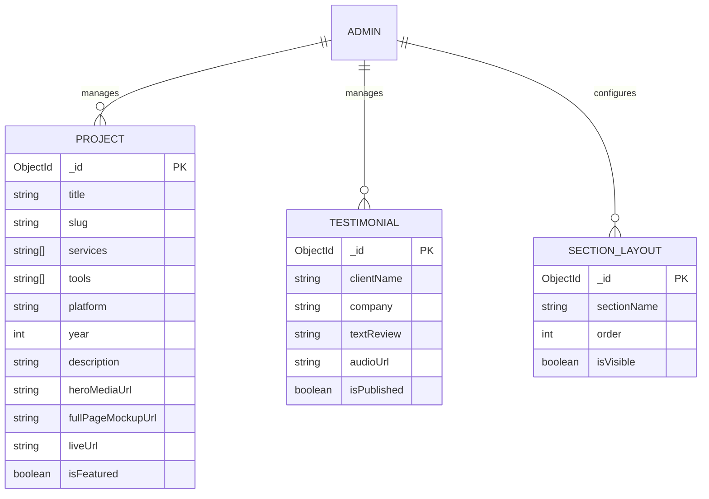

# Architecture: Luxury Designer Portfolio

## System Architecture
A Monolithic Next.js (App Router) architecture where both the Frontend and the Dashboard Admin panel live in the same repository. We use Next.js API routes as the backend, connecting directly to MongoDB. To maintain the strict "Vertical Slices" for Menna and Naira, the repository structure will isolate their features as much as possible using a modular folder structure.

```mermaid
graph TB
    Client[Public Site Visitor] --> Next[Next.js App Router]
    Admin[Admin User] --> Next
    Next --> DB[(MongoDB Atlas)]
    Next --> Cloudinary[Cloudinary CDN]
    
    subgraph Menna's Vertical Slice
        Next --> API_Projects[/api/projects]
        Next --> UI_Projects[app/projects]
        Next --> Admin_Projects[app/admin/projects]
    end

    subgraph Naira's Vertical Slice
        Next --> API_Layout[/api/layout]
        Next --> API_Testimonials[/api/testimonials]
        Next --> UI_Home[app/home]
        Next --> Admin_Layout[app/admin/layout]
    end
```

## Tech Stack
### Frontend
- **Framework:** Next.js (App Router) with TypeScript.
- **Styling:** Tailwind CSS + Vanilla CSS Modules for complex GSAP elements.
- **Animation:** GSAP (ScrollTrigger) & React Three Fiber (Three.js).
### Backend
- **Framework:** Next.js Route Handlers (`app/api/...`).
- **ORM:** Mongoose.
### Database
- **Primary DB:** MongoDB Atlas.
### Infrastructure
- **Hosting:** Vercel (ideal for Next.js).
- **Media CDN:** Cloudinary (for videos, long mockup screenshots, and audio).
### Third-Party Services
- **Auth:** NextAuth.js (Credentials Provider with Email/Password).

## Data Model
### ERD


## API Design
### Overview
RESTful routes built into Next.js App Router.
### Authentication
NextAuth session tokens required for all `/api/admin/*` routes.
### Endpoints
- **Projects (Menna):**
  - `GET /api/projects`
  - `POST /api/admin/projects`
  - `PUT /api/admin/projects/:id`
  - `DELETE /api/admin/projects/:id`
- **Layout & Content (Naira):**
  - `GET /api/layout`
  - `PUT /api/admin/layout`
  - `GET /api/testimonials`
  - `POST /api/admin/testimonials`

## Technical Decisions
- **Vertical Feature Slicing:** To prevent merge conflicts, Menna and Naira will work in separate route groups (`app/(projects)` vs `app/(blog)`) and separate API namespaces.
- **Cloudinary:** Used directly from the client via signed uploads to avoid sending massive screenshots through the Next.js API limits.

## Risks and Mitigations
- **Risk:** Menna and Naira might duplicate shared UI components (like Buttons or Cards). 
- **Mitigation:** We will have a `components/shared` folder built first, which both can use.
